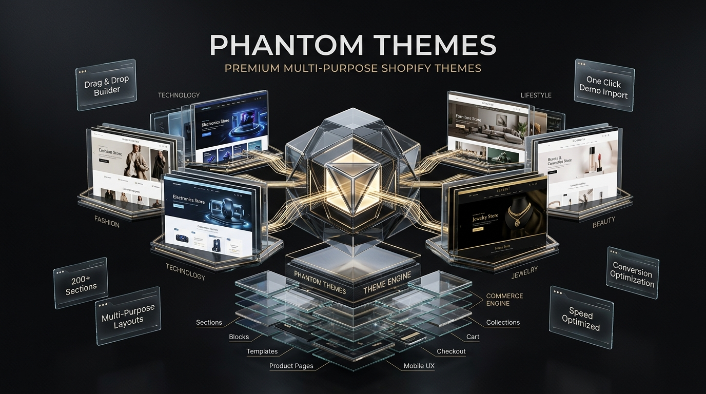

<picture>
  <source media="(prefers-color-scheme: dark)" srcset="bannar.jpeg">
  
</picture>

# PHANTOM Theme v2.2.0

> A premium, feature-rich Shopify Online Store 2.0 theme built for visually-driven, conversion-optimized stores. Fashion, lifestyle, and DTC brands that demand polish, performance, and motion.

[](https://shopify.dev)
[](LICENSE)

---

## ✨ Features

### 🎨 Design & Customization
- **56+ modular sections** — slideshows, featured collections, testimonials, rich text, promo grids, countdown timers, image compare, hotspots, quiz, and more
- **5 style presets** — Default, Minimal, Editorial, Bold, Luxury — one-click color & typography switching
- **Full color system** — body, header, footer, drawers, buttons, sale tags, overlays, borders
- **Typography controls** — Google Font Picker, letter spacing, line height, transforms, alignment
- **Button styles** — square, round-slight, round, angled
- **Design tokens** — CSS custom properties for spacing (12-step), shadows (5-level), z-index (6-layer), border radius, elevation

### 🎬 PH MOTION™
- **Scroll entrance animations** — fade-up, scale-in, blur-in, slide-left, slide-right, rotate-in
- **Page view transitions** — View Transitions API powered
- **Stagger effects** — sequential element reveals (50–300ms configurable)
- **Skeleton loading** — branded loading placeholders
- **Page loader** — custom logo + tagline loading animation
- **Per-section animation overrides**

### 🛍️ Product Experience
- **Flex PDP** — Flexible Product Detail Page with 6 template variants
- **Quick shop modal** — product quick-view from collection grids
- **Predictive search** — type-ahead with products, pages, articles
- **Color swatches** — round or square on grid tiles
- **Recently viewed** — personalized product history
- **Size guide popup** — configurable sizing charts
- **Countdown timer** — urgency & scarcity
- **Urgency bar** — low-stock indicators
- **Free shipping bar** — progress-tracking incentive
- **Product recommendations** — Shopify-powered suggestions

### 🧩 Advanced Modules
- **Interactive quiz** — product discovery engine
- **Image compare** — before/after slider
- **Hotspots** — shoppable image annotations
- **Offers drawer** — slide-out promotions panel
- **Scrolling text/banners** — marquee-style announcements
- **Age verification** — optional gate popup
- **Newsletter popup** — timed email capture with reminder
- **Multi-currency & locale selector**

### 🏗️ Architecture
- **Section groups** — header, footer, and popup groups for drag-and-drop management
- **100+ snippets** — reusable Liquid components
- **SEO optimized** — structured meta tags, breadcrumbs, canonical URLs
- **RTL support** — right-to-left text direction
- **12 language locales** — EN, DE, ES, FR, IT, PT-BR, PT-PT
- **No build tooling** — pure Liquid / CSS / JS

---

## 📁 Structure

```
phantom-theme-v2.2.0/
├── assets/           # CSS, JS, SVG icons, images
├── blocks/           # Reusable nested components
├── config/           # Theme settings & presets
├── layout/           # theme.liquid, password, gift_card
├── locales/          # 12 translation files (7 languages)
├── sections/         # 56+ modular page sections
├── snippets/         # 100+ reusable Liquid fragments
└── templates/        # Page, product, collection, blog, cart, search
    └── customers/    # Account, login, register, addresses, orders
```

### Key Templates

| Type | Templates |
|------|-----------|
| **Product** | Default, Brand Story, Gift Card, High Variant (Flex PDP), Modal, Pre-order, Landing |
| **Collection** | Default, No Sidebar, No Promos, Landing |
| **Page** | Standard, About, Contact, FAQ, Full Width |

---

## 🚀 Installation

### Shopify CLI (recommended)

```bash
shopify theme init --clone https://github.com/HAmmadsiamil007/shopify-phantom-.git
shopify theme dev
```

### Theme Kit

```bash
theme get --password=[API_PASSWORD] --store=[STORE].myshopify.com --themeid=[THEME_ID]
```

### Manual

1. Download the latest release
2. In Shopify Admin: **Online Store > Themes > Add theme > Upload zip**
3. Upload the `phantom-theme-v2.2.0` directory as a zip

---

## ⚙️ Requirements

- **Shopify Online Store 2.0** — this theme uses JSON templates, section groups, and app blocks
- Modern browser with JavaScript enabled (for animations, quick shop, cart drawer)

---

## 🎯 Customization

Navigate to **Shopify Admin > Online Store > Themes > Customize**. Key settings panels:

| Panel | What you can do |
|-------|----------------|
| **Style Presets** | Switch between 5 design directions instantly |
| **Colors** | Full palette control across all surfaces |
| **Typography** | Font family, size, weight, spacing, transforms |
| **PH MOTION** | Enable/disable animations, choose entrance effects, stagger timing |
| **Products** | Image sizes, hover behavior, quick shop, swatches |
| **Cart** | Drawer vs page, icon style, notes, terms |
| **Header / Footer** | Layout, announcement bar, social links, currency selector |
| **Per-section** | Background, parallax, text alignment, animation overrides |

---

## 📦 What's Included

- Full theme source (Liquid + CSS + JS)
- 56+ sections & section groups
- 100+ snippets
- 23 JavaScript modules
- 6 CSS files (theme, design tokens, motion, transitions, skeleton, loader)
- 80+ SVG icons (UI + social + branded)
- Page templates for all standard Shopify page types
- 7 language locale files (with schema translations)

---

## 📜 Changelog

### v2.2.0 — Initial Release
- Complete Shopify OS 2.0 theme with 56+ sections
- Flex PDP with 6 product template variants
- PH MOTION animation system (scroll entrances, page transitions, stagger, skeleton)
- Design token system with CSS custom properties
- 5 style presets (Default, Minimal, Editorial, Bold, Luxury)
- Multi-language support (7 languages, 12 translation files)
- Quick shop, predictive search, cart drawer
- Advanced modules: quiz, image compare, hotspots, countdown, urgency bar

---

## 🤝 Support

For support, feature requests, or bug reports:

- **GitHub Issues**: [Create an issue](https://github.com/HAmmadsiamil007/shopify-phantom-/issues)
- **Email**: phantomthemes@example.com

---

<p align="center">
  Built with ❤️ by <strong>PHANTOM Themes</strong>
</p>
